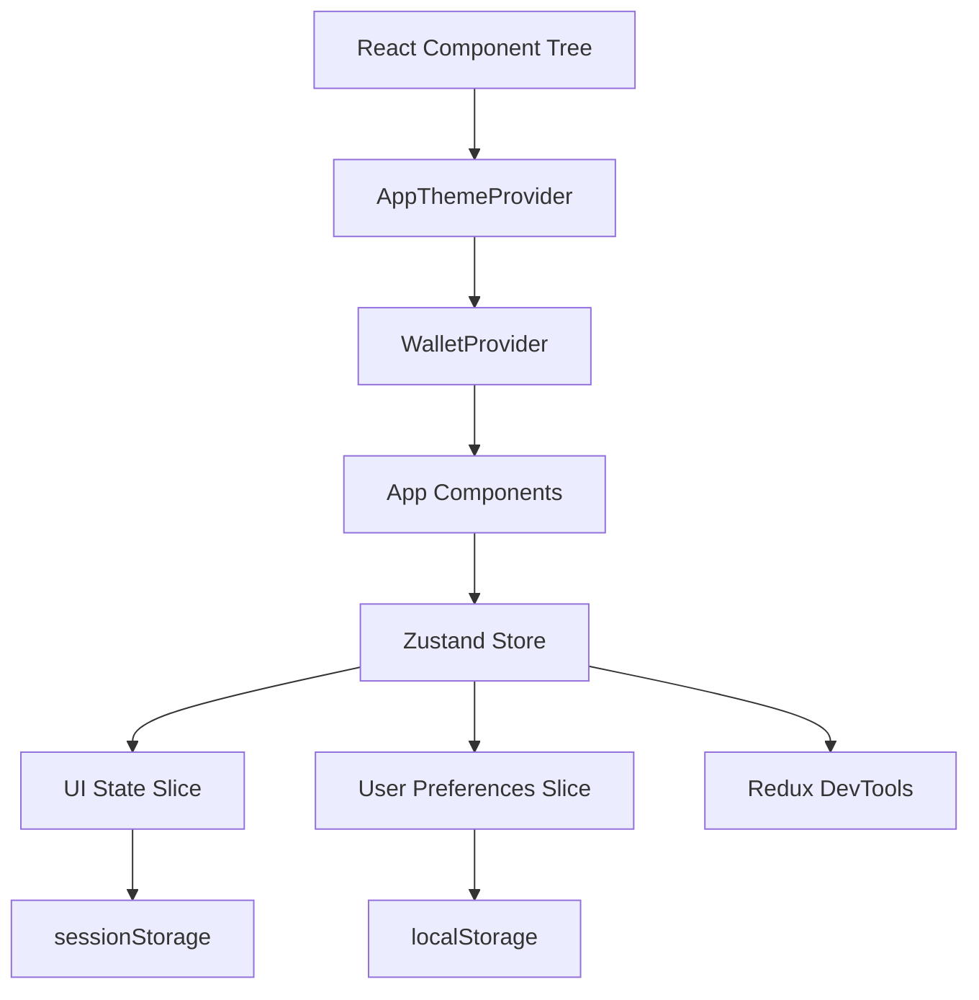

# Design Document: Global State Management

## Overview

This design document specifies the implementation of a global state management solution for the Stellar-Save frontend application. The solution will use Zustand as the state management library, providing a lightweight, TypeScript-friendly approach to managing application-wide state including UI preferences and user settings.

### Design Goals

- Implement a centralized state management solution that coexists with the existing WalletProvider
- Provide type-safe state access and mutations throughout the application
- Enable state persistence across browser sessions for user preferences
- Support efficient debugging and development workflows
- Maintain minimal bundle size impact (< 5KB gzipped)
- Ensure optimal rendering performance through selective subscriptions

### Solution Selection: Zustand

After evaluating Redux Toolkit, Context API, and Zustand against the requirements, Zustand is selected for the following reasons:

1. **Minimal Bundle Size**: Zustand core is ~1.2KB gzipped, well under the 5KB requirement
2. **TypeScript Excellence**: First-class TypeScript support with full type inference
3. **Simple API**: Hooks-based API with minimal boilerplate compared to Redux
4. **Built-in DevTools**: Native Redux DevTools integration for debugging
5. **Middleware Ecosystem**: Built-in persistence and immer middleware
6. **No Provider Wrapping**: Can be used without wrapping the component tree, avoiding conflicts with WalletProvider
7. **Selective Subscriptions**: Components only re-render when their selected state changes
8. **Testing Support**: Easy to create isolated store instances for testing

### Architecture Principles

- **Separation of Concerns**: Wallet state remains in WalletProvider; application state moves to Zustand
- **Domain-Driven Slices**: State organized by domain (UI, user preferences) for maintainability
- **Immutable Updates**: All state modifications use immutable patterns (via immer middleware)
- **Persistence Strategy**: User preferences persist to localStorage; UI state to sessionStorage
- **Type Safety First**: Full TypeScript coverage with no `any` types in store definitions

## Architecture

### High-Level Architecture



### State Management Layers

1. **Wallet Layer** (Existing): WalletProvider manages wallet-specific state
   - Connection status, active address, network, connected accounts
   - Remains unchanged, uses Context API

2. **Application Layer** (New): Zustand store manages application state
   - UI state (sidebar, modals, view modes)
   - User preferences (language, currency, notifications)
   - No provider wrapping required

3. **Persistence Layer**: Middleware handles storage
   - localStorage for user preferences (long-term)
   - sessionStorage for UI state (session-only)

### Store Organization

The Zustand store will be organized into slices using a combined store pattern:

```
store/
├── index.ts              # Store creation and exports
├── slices/
│   ├── uiSlice.ts       # UI state slice
│   └── preferencesSlice.ts  # User preferences slice
├── middleware/
│   └── persistence.ts   # Custom persistence middleware
├── types.ts             # TypeScript type definitions
└── testUtils.ts         # Testing utilities
```

## Components and Interfaces

### Store Structure

The store combines multiple slices into a single store instance:

```typescript
interface AppStore {
  // UI State Slice
  ui: {
    sidebarOpen: boolean;
    activeModal: string | null;
    viewMode: 'grid' | 'list';
    theme: 'light' | 'dark' | 'system';
  };
  
  // UI Actions
  toggleSidebar: () => void;
  openModal: (modalId: string) => void;
  closeModal: () => void;
  setViewMode: (mode: 'grid' | 'list') => void;
  setTheme: (theme: 'light' | 'dark' | 'system') => void;
  
  // User Preferences Slice
  preferences: {
    language: string;
    currencyDisplay: 'code' | 'symbol';
    notificationsEnabled: boolean;
    soundEnabled: boolean;
  };
  
  // Preference Actions
  setLanguage: (language: string) => void;
  setCurrencyDisplay: (display: 'code' | 'symbol') => void;
  toggleNotifications: () => void;
  toggleSound: () => void;
  resetPreferences: () => void;
}
```

### UI State Slice

**Purpose**: Manages ephemeral UI state that should persist only during the current session.

**State Shape**:
```typescript
interface UIState {
  sidebarOpen: boolean;
  activeModal: string | null;
  viewMode: 'grid' | 'list';
  theme: 'light' | 'dark' | 'system';
}
```

**Actions**:
- `toggleSidebar()`: Toggles sidebar open/closed state
- `openModal(modalId: string)`: Opens a modal by ID
- `closeModal()`: Closes the currently active modal
- `setViewMode(mode)`: Sets the view mode for list displays
- `setTheme(theme)`: Sets the application theme preference

**Persistence**: sessionStorage (cleared on browser close)

### User Preferences Slice

**Purpose**: Manages user preferences that should persist across sessions.

**State Shape**:
```typescript
interface PreferencesState {
  language: string;
  currencyDisplay: 'code' | 'symbol';
  notificationsEnabled: boolean;
  soundEnabled: boolean;
}
```

**Actions**:
- `setLanguage(language)`: Updates the user's language preference
- `setCurrencyDisplay(display)`: Sets currency display format
- `toggleNotifications()`: Toggles notification preferences
- `toggleSound()`: Toggles sound effects
- `resetPreferences()`: Resets all preferences to defaults

**Persistence**: localStorage (persists indefinitely)

### Custom Hooks

The store will expose domain-specific hooks for component consumption:

```typescript
// Hook for UI state
function useUIState(): UIState & UIActions;
function useUIState<T>(selector: (state: UIState) => T): T;

// Hook for preferences
function usePreferences(): PreferencesState & PreferencesActions;
function usePreferences<T>(selector: (state: PreferencesState) => T): T;

// Hook for full store (use sparingly)
function useAppStore(): AppStore;
function useAppStore<T>(selector: (state: AppStore) => T): T;
```

### Integration with Existing Architecture

**WalletProvider Coexistence**:
- WalletProvider continues to manage wallet state via Context API
- Zustand store operates independently without provider wrapping
- No modifications required to WalletProvider or useWallet hook
- Both can be used simultaneously in components

**Component Usage Pattern**:
```typescript
function MyComponent() {
  // Wallet state (existing pattern)
  const { activeAddress, connect } = useWallet();
  
  // Application state (new pattern)
  const sidebarOpen = useUIState(state => state.sidebarOpen);
  const toggleSidebar = useUIState(state => state.toggleSidebar);
  
  // Both work together seamlessly
}
```

## Data Models

### Store State Type Definitions

```typescript
// Core state types
type ViewMode = 'grid' | 'list';
type Theme = 'light' | 'dark' | 'system';
type CurrencyDisplay = 'code' | 'symbol';

// UI State
interface UIState {
  sidebarOpen: boolean;
  activeModal: string | null;
  viewMode: ViewMode;
  theme: Theme;
}

// User Preferences
interface PreferencesState {
  language: string;
  currencyDisplay: CurrencyDisplay;
  notificationsEnabled: boolean;
  soundEnabled: boolean;
}

// Combined store state
interface AppStoreState {
  ui: UIState;
  preferences: PreferencesState;
}

// Action types
interface UIActions {
  toggleSidebar: () => void;
  openModal: (modalId: string) => void;
  closeModal: () => void;
  setViewMode: (mode: ViewMode) => void;
  setTheme: (theme: Theme) => void;
}

interface PreferencesActions {
  setLanguage: (language: string) => void;
  setCurrencyDisplay: (display: CurrencyDisplay) => void;
  toggleNotifications: () => void;
  toggleSound: () => void;
  resetPreferences: () => void;
}

// Full store type
type AppStore = AppStoreState & UIActions & PreferencesActions;
```

### Default State Values

```typescript
const DEFAULT_UI_STATE: UIState = {
  sidebarOpen: true,
  activeModal: null,
  viewMode: 'grid',
  theme: 'system',
};

const DEFAULT_PREFERENCES: PreferencesState = {
  language: 'en',
  currencyDisplay: 'code',
  notificationsEnabled: true,
  soundEnabled: true,
};
```

### Persistence Configuration

```typescript
interface PersistenceConfig {
  name: string;              // Storage key
  storage: Storage;          // localStorage or sessionStorage
  partialize?: (state: AppStore) => Partial<AppStore>;  // Select what to persist
  version?: number;          // Schema version for migrations
  migrate?: (persistedState: unknown, version: number) => AppStore;
}

// UI state persistence (sessionStorage)
const uiPersistConfig: PersistenceConfig = {
  name: 'stellar-save-ui',
  storage: sessionStorage,
  partialize: (state) => ({ ui: state.ui }),
};

// Preferences persistence (localStorage)
const preferencesPersistConfig: PersistenceConfig = {
  name: 'stellar-save-preferences',
  storage: localStorage,
  partialize: (state) => ({ preferences: state.preferences }),
  version: 1,
};
```

### Storage Schema

**sessionStorage key**: `stellar-save-ui`
```json
{
  "state": {
    "ui": {
      "sidebarOpen": true,
      "activeModal": null,
      "viewMode": "grid",
      "theme": "system"
    }
  },
  "version": 0
}
```

**localStorage key**: `stellar-save-preferences`
```json
{
  "state": {
    "preferences": {
      "language": "en",
      "currencyDisplay": "code",
      "notificationsEnabled": true,
      "soundEnabled": true
    }
  },
  "version": 1
}
```


## Correctness Properties

A property is a characteristic or behavior that should hold true across all valid executions of a system—essentially, a formal statement about what the system should do. Properties serve as the bridge between human-readable specifications and machine-verifiable correctness guarantees.

### Property 1: Immutable State Updates

For any state in the store and any action that modifies that state, calling the action should not mutate the previous state object—the previous state should remain unchanged and a new state object should be created.

**Validates: Requirements 2.6, 3.4**

### Property 2: Preferences Persistence to localStorage

For any user preference update (language, currency display, notifications, sound), after the action completes, localStorage should contain the updated preference value under the key 'stellar-save-preferences'.

**Validates: Requirements 4.1**

### Property 3: UI State Persistence to sessionStorage

For any UI state update (sidebar, modal, view mode, theme), after the action completes, sessionStorage should contain the updated UI state value under the key 'stellar-save-ui'.

**Validates: Requirements 4.2**

### Property 4: Persistence Serialization Format

For any persisted state in localStorage or sessionStorage, the stored value should be valid JSON that can be parsed without errors.

**Validates: Requirements 4.5**

### Property 5: Persistence Round-Trip

For any valid store state, persisting the state to storage and then hydrating from that storage should produce an equivalent state object with all values preserved.

**Validates: Requirements 4.7**

### Property 6: Selective Re-rendering

For any component subscribed to a specific state slice, when state in a different slice changes, the component should not re-render—components should only re-render when their selected state changes.

**Validates: Requirements 6.5, 7.1**

### Property 7: Selector Memoization

For any derived state selector with expensive computation, when called multiple times with the same input state, the selector should return the same memoized result without recomputing, reducing unnecessary calculations.

**Validates: Requirements 7.3**

### Property 8: Batched State Updates

For any sequence of multiple synchronous state updates, the store should batch them into a single render cycle, resulting in only one component re-render rather than multiple re-renders.

**Validates: Requirements 7.4**

## Error Handling

### Storage Errors

**Corrupted Data Handling**:
- When hydrating from storage, if JSON parsing fails, the store will catch the error
- Default state values will be used instead of corrupted data
- A warning will be logged to the console with details about the corruption
- The corrupted storage entry will be cleared to prevent repeated errors

**Storage Quota Exceeded**:
- When persisting state, if storage quota is exceeded, the error will be caught
- The operation will fail silently to prevent application crashes
- An error will be logged to the console
- The application will continue functioning with in-memory state only

**Storage Unavailable**:
- If localStorage or sessionStorage is unavailable (private browsing, disabled)
- The store will detect this during initialization
- Persistence will be disabled gracefully
- The application will function normally with in-memory state only
- A warning will be logged once during initialization

### Action Errors

**Invalid Action Parameters**:
- TypeScript will prevent invalid parameters at compile time
- Runtime validation is not performed for performance reasons
- Developers should rely on TypeScript for parameter validation

**State Update Failures**:
- Zustand's immer middleware ensures state updates are atomic
- If an update throws an error, the state remains unchanged
- Errors will propagate to the calling component
- Components should use error boundaries to handle update failures

### Hydration Errors

**Version Mismatch**:
- If persisted state version doesn't match current version
- Migration function will be called to transform old state to new format
- If migration fails, default state will be used
- A warning will be logged about the migration failure

**Missing Required Fields**:
- If hydrated state is missing required fields
- Default values will be merged with hydrated state
- Partial hydration will succeed with defaults for missing fields
- No error will be thrown, ensuring graceful degradation

### DevTools Errors

**DevTools Connection Failure**:
- If Redux DevTools extension is not installed
- The store will function normally without devtools
- No error will be thrown or logged
- Devtools middleware will be a no-op in production

## Testing Strategy

### Dual Testing Approach

The global state management implementation will use both unit testing and property-based testing to ensure comprehensive coverage:

**Unit Tests**: Focus on specific examples, edge cases, and error conditions
- Specific action behaviors (e.g., toggling sidebar opens/closes correctly)
- Edge cases (e.g., corrupted storage data, missing fields)
- Error conditions (e.g., storage quota exceeded, unavailable storage)
- Integration with React components
- DevTools configuration in different environments

**Property Tests**: Verify universal properties across all inputs
- Immutability of state updates across all actions
- Persistence round-trips for all state shapes
- Selective re-rendering for all state slices
- Batching behavior for all update sequences
- Memoization for all selectors

Together, unit tests catch concrete bugs in specific scenarios, while property tests verify general correctness across the entire input space.

### Property-Based Testing Configuration

**Library Selection**: We will use `@fast-check/vitest` for property-based testing, which integrates seamlessly with our existing Vitest test setup.

**Test Configuration**:
- Each property test will run a minimum of 100 iterations to ensure comprehensive input coverage
- Tests will use fast-check's built-in generators for primitives and custom generators for domain types
- Each property test will include a comment tag referencing its design document property

**Tag Format**:
```typescript
// Feature: global-state-management, Property 1: Immutable State Updates
test.prop([fc.record({...})])('state updates are immutable', (initialState) => {
  // Test implementation
});
```

**Property Test Coverage**:
1. Property 1 (Immutability): Generate random initial states and random actions, verify previous state unchanged
2. Property 2 (Preferences Persistence): Generate random preference values, verify localStorage contains them
3. Property 3 (UI Persistence): Generate random UI states, verify sessionStorage contains them
4. Property 4 (JSON Format): Generate random states, verify stored values are valid JSON
5. Property 5 (Round-Trip): Generate random states, verify persist→hydrate preserves values
6. Property 6 (Selective Rendering): Generate random state changes, verify only subscribed components render
7. Property 7 (Memoization): Generate random states, verify selectors don't recompute unnecessarily
8. Property 8 (Batching): Generate random update sequences, verify single render cycle

### Unit Test Coverage

**Store Creation and Initialization**:
- Store initializes with correct default values
- Store structure includes all required slices
- Custom hooks are exported and accessible

**UI State Actions**:
- `toggleSidebar()` toggles between true/false
- `openModal(id)` sets activeModal to the provided id
- `closeModal()` sets activeModal to null
- `setViewMode(mode)` updates viewMode
- `setTheme(theme)` updates theme

**Preferences Actions**:
- `setLanguage(lang)` updates language
- `setCurrencyDisplay(display)` updates currency display
- `toggleNotifications()` toggles notifications
- `toggleSound()` toggles sound
- `resetPreferences()` restores all defaults

**Persistence Behavior**:
- Preferences save to localStorage on update
- UI state saves to sessionStorage on update
- Store hydrates from storage on initialization
- Corrupted storage data falls back to defaults
- Missing storage fields merge with defaults

**Error Handling**:
- Storage quota exceeded handled gracefully
- Storage unavailable handled gracefully
- Invalid JSON in storage handled gracefully
- Version mismatch triggers migration

**DevTools Integration**:
- DevTools enabled in development environment
- DevTools disabled in production environment
- DevTools connection failure doesn't break store

**React Integration**:
- Components using useUIState re-render on UI state changes
- Components using usePreferences re-render on preference changes
- Components don't re-render on unrelated state changes
- Multiple components can subscribe to same state
- Store works alongside WalletProvider without conflicts

**Testing Utilities**:
- `createTestStore()` creates isolated store instances
- Test store accepts custom initial state
- Test store works with React Testing Library
- Actions can be spied on in tests
- State can be mocked for component tests

### Test File Organization

```
src/store/
├── __tests__/
│   ├── store.test.ts              # Store creation and structure
│   ├── uiSlice.test.ts            # UI state actions
│   ├── preferencesSlice.test.ts   # Preferences actions
│   ├── persistence.test.ts        # Persistence behavior
│   ├── integration.test.tsx       # React integration
│   └── properties.test.ts         # Property-based tests
└── testUtils.ts                   # Testing utilities
```

### Integration with Existing Tests

The new state management tests will follow the existing test patterns in the Stellar-Save frontend:
- Use Vitest as the test runner (already configured)
- Use React Testing Library for component tests (already in use)
- Follow existing test file naming conventions (`*.test.ts`, `*.test.tsx`)
- Use the existing test setup in `src/test/setup.ts`
- Maintain similar test structure and assertions as existing component tests

